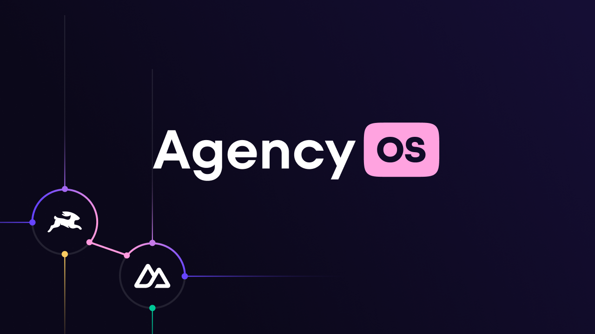

<a href="https://directus.io" target="_blank">
  
  <h1 align="center">AgencyOS</h1>
</a>

<p align="center">AgencyOS is everything you need to get your agency off the ground, or improve tooling for your existing company. Nuxt 3 Website / Application + Directus Backend.</p>

<p align="center"><em>Brought to you by partnership magic between <a href="https://directus.io" target="_blank">Directus</a> and <a href="https://nuxtlabs.com" target="_blank">NuxtLabs</a>.</em>
</p>

<p align="center">
  <a href="#introduction"><strong>Introduction</strong></a> ·
  <a href="#features"><strong>Features</strong></a> ·
  <a href="#installation-and-development"><strong>Installation and Development</strong></a> ·
  <a href="#deployment"><strong>Deployment</strong></a> ·
  <a href="#tech-stack"><strong>Tech Stack</strong></a> ·
  <a href="#community-help"><strong>Community Help</strong></a> ·
  <a href="#contributing"><strong>Contributing</strong></a>
</p>
<br/>
<br />

# Introduction

One of the **easiest parts** of running a successful digital agency is doing the **actual work**. I mean - who doesn't
love to put their head down to collaborate, design, and build amazing stuff for clients?

The **hard bits** are everything else that goes along with that – managing large projects with tons of moving pieces,
communicating with clients to properly manage expectations, ensuring you're paid on time, and more.

When every billable hour counts, you don't have the time to build your own tools from scratch. And you shouldn't be
forced to settle for off-the-shelf tech that falls short of your preferred workflow.

**AgencyOS is the open source operating system to help you run (or start) your digital agency.** It's built on open
source tools (Nuxt and Directus) and designed to be 100% hackable so you can build YOUR solution, YOUR project
management app, YOUR agency's operating system – in record time.

**Why?**

Quite a few folks on the [Directus](https://github.com/directus/directus) core team have experience running agencies and
we know it's not all rainbows and sunshine. We wanted to build an tool that our
[agency partners](https://directus.io/solutions/agencies) (and any other agency) would get a lot of value from. It was
also created as a complete example to showcase the power and flexibility of Directus as a platform to rapidly build your
own apps and tools.

**Getting Started**

- [Read Installation Instructions](#installation-and-development)
- [View The Demo Site](https://agency-os.vercel.app/)
- [Watch the Video Tutorials](https://www.youtube.com/playlist?list=PLD--x9rY3ZL1tPNZxCTE_-IsFTrFGKHH-)

---

# Features

## Website

When you're hard at work delivering for clients - your own site tends to suffer. AgencyOS includes beautiful website
template that's easily customizable and already integrated with an easy-to-use headless CMS.

It's not a starter template. It's a complete website project for you customize or inspire you to build an even better
solution.

- Dynamic page builder with live preview
- Blog posts and categories
- Dynamic form generation with validation
- Dynamic OG image generation
- Full SEO support out of the box – (meta tags, sitemap, redirects, JSON-LD, and more)
- Global search functionality
- Common utilities so you don't need to include yet another package
- Google Fonts support
- ESLint and Prettier pre-configured
- Full dark mode support
- Themeable with easy config file

### CRM / Project Tracker

Maintaining important client relationships doesn't just fall to the sales team. So why maintain separate project
management and CRM tools? AgencyOS includes a completely customizable CRM so you can work the way you want.

- Organizations and contacts
- Sales pipeline and activities
- Dynamic project proposal builder
- Project and task management
- Customizable project templates
- Invoicing and expense tracking
- Customize and build your own dashboards without writing code
- Automate processes using Directus Flows

### Client Portal

Communication is probably the biggest driver of project success. With AgencyOS's private client portal - you can insure
your clients stay up to date and even hold them accountable for delivering the files and information you need to
complete their project

- Private authenticated portal for clients to self-serve
- Clients can view their projects, tasks, and files
- Clients can pay invoices through Stripe
- Assign tasks to clients as part of project templates

<br />

---

<br />

# Installation and Development

AgencyOS is structured as a monorepo with two main parts:

- **`directus/`** – Directus backend (Docker Compose + template data)
- **`nuxt/`** – Nuxt 3 frontend (website + client portal)

## Project Structure

```
agency-os/
├── directus/              # Directus backend
│   ├── docker-compose.yaml
│   ├── .env.example
│   ├── run-scripts/       # Flow operation scripts
│   └── template/          # Directus schema and sample content
├── nuxt/                  # Nuxt 3 frontend
│   ├── package.json
│   ├── nuxt.config.ts
│   └── ...
├── package.json           # Root config (directus:template metadata)
└── README.md
```

## Quick Start (Recommended)

The fastest way to get started is with the Directus Template CLI:

```bash
npx directus-template-cli@latest init --template=https://github.com/directus-labs/agency-os
```

This sets up both the Directus backend and Nuxt frontend for you.

## Manual Setup

### 1 - Set Up Directus Backend

There are two ways to get a Directus instance running:

**Option A - Directus Cloud**

The easiest option. Register at [directus.cloud](https://directus.cloud/register) and create a new project. Directus
offers a 14 day free trial which is plenty of time to try AgencyOS.
[See pricing](https://directus.io/pricing/cloud) for details.

**Option B - Self-Host with Docker**

[PostgreSQL](https://www.postgresql.org/) is the tested and preferred database for this project.

```bash
cd directus
cp .env.example .env
docker compose up -d
# Directus will be available at http://localhost:8055/
```

You'll need [Docker](https://docs.docker.com/get-docker/) installed. See the
[Directus Docker Guide](https://docs.directus.io/self-hosted/docker-guide.html) for more details.

**Important Note**: Community self-hosted instances are not covered by Directus support. For enterprise support,
[contact the Directus team](https://directus.io/pricing/self-hosted).

### 2 - Generate a Static Token for the Admin User

You need a static token to seed the project with the template data.

1. Go to the User Directory in your Directus instance
2. Choose the Administrative User
3. Scroll down to the Token field
4. Generate token and copy it
5. Save the user (don't forget to save!)

### 3 - Apply the AgencyOS Template

```bash
npx directus-template-cli@latest apply
```

1. Choose the `Agency OS` template
2. Paste the URL to your Directus instance
3. Paste your Admin user static token
4. Wait for the script to finish

Learn more about the [Directus Template CLI](https://github.com/directus-community/directus-template-cli).

<br />

---

<br />

### 4 - Set Up the Nuxt Frontend

```bash
cd nuxt
cp .env.example .env
```

Update the `.env` with your Directus URL and token.

```bash
pnpm install
pnpm dev
```

Visit [http://localhost:3000](http://localhost:3000/)

To build for production:

```bash
pnpm build
```

<br />

# Deployment

## Deploying the Nuxt Frontend

Please check the official [Nuxt Deployment Documentation](https://nuxt.com/docs/getting-started/deployment) for
supported providers. Here are a few popular options:

### One Click Options

Note: When deploying, set the **Root Directory** to `nuxt/` in your hosting provider's settings.

**Vercel**

<a href="https://vercel.com/new/clone?repository-url=https%3A%2F%2Fgithub.com%2Fdirectus-labs%2Fagency-os&env=DIRECTUS_URL,DIRECTUS_SERVER_TOKEN,NUXT_PUBLIC_SITE_URL,STRIPE_SECRET_KEY,STRIPE_PUBLISHABLE_KEY,STRIPE_WEBHOOK_SECRET&project-name=agency-os&root-directory=nuxt&demo-title=AgencyOS&demo-description=AgencyOS%20-%20Nuxt%203%20%2B%20Directus%20for%20agencies&demo-url=https%3A%2F%2Fagencyos.dev&demo-image=https%3A%2F%2Fgithub.com%2Fdirectus-labs%2Fagency-os%2Fraw%2Fmain%2Fnuxt%2Fpublic%2Flogos%2Fagencyos.png&skippable-integrations=1"></a>

**Netlify**

<a href="https://app.netlify.com/start/deploy?repository=https://github.com/directus-labs/agency-os#DIRECTUS_URL=https://youruniqueid.directus.app"></a>

Note: For Netlify, set the **Base directory** to `nuxt/` in your site settings.

## Deploying the Directus Backend

If you don't want to mess with DevOps, [spin up a project on Directus Cloud](https://directus.cloud/) in about
90 seconds.

For self-hosting, Docker is the recommended approach. See the
[Directus Docker Guide](https://docs.directus.io/self-hosted/docker-guide.html).

**Resources for Self Hosting Directus**

- [Deploy Directus to DigitalOcean with Docker](https://docs.directus.io/blog/deploy-directus-digital-ocean-docker.html)
- [Deploy Directus on Railway](https://railway.app/template/2fy758)

<br />

---

<br />

# Tech Stack

<a href="https://nuxt.com" target="_blank"></a>

## Nuxt

Build your next Vue.js application with confidence using Nuxt. An open source framework under MIT license that makes web
development simple and powerful.

[Learn more about Nuxt](https://nuxt.com)

<br />

<a href="https://directus.io" target="_blank"></a>

## Directus

Directus is a headless CMS that instantly turns your SQL database into REST and GraphQL APIs and gives you a beautiful,
intuitive no-code app to manage all your content and data.

[Learn more about Directus](https://directus.io)

---

## UI

- [Nuxt UI](https://ui.nuxt.com/) - Official UI component library for Nuxt.
- [Tailwind CSS](https://tailwindcss.com/) – Utility-first CSS framework with
  [Typography](https://tailwindcss.com/docs/typography-plugin) and [Forms](https://tailwindcss.com/docs/plugins#forms)
  plugins.
- [Headless UI](https://headlessui.dev/) – Fully accessible, unstyled UI components.
- [FormKit](https://formkit.com/) – Form library for Vue with validation, theming, and schema generation.
- [Nuxt Icon](https://github.com/nuxt-modules/icon) - Icon component with thousands of icons via
  [Iconify](https://icones.js.org/).

## Utilities

- [VueUse](https://vueuse.org/) – Collection of Vue Composition Utilities.
- [VueUse Motion](https://motion.vueuse.org/) – Composables for component animations.

<br />

# Community Help

- **[Directus Discord](https://discord.com/invite/directus)** – Join over 10k+ developers for questions and discussion.
- **[Nuxt Discord](https://discord.com/invite/ps2h6QT)**

<br />

# Contributing

AgencyOS is a community driven project so we'd love to have your contributions.

- [Open an issue](https://github.com/directus-labs/agency-os/issues) if you believe you've encountered a bug.
- [Make a pull request](https://github.com/directus-labs/agency-os/pulls) to add new features or fix bugs.

## Thanks To

AgencyOS was created by Bryant Gillespie ([@bryantgillespie](https://twitter.com/bryantgillespie)). But big thank yous
are owed to...

- [@rijkvanzanten](https://github.com/rijkvanzanten) and [@benhaynes](https://github.com/benhaynes) for building
  Directus and including me on the journey.
- [@atinux](https://github.com/Atinux) and [@alexchopin](https://github.com/alexchopin) for creating the Nuxt framework.
- [@intevel](https://github.com/Intevel) and [@becem-gharbi](https://github.com/becem-gharbi) for each of their separate
  `nuxt-directus` modules which served as source of inspiration.
